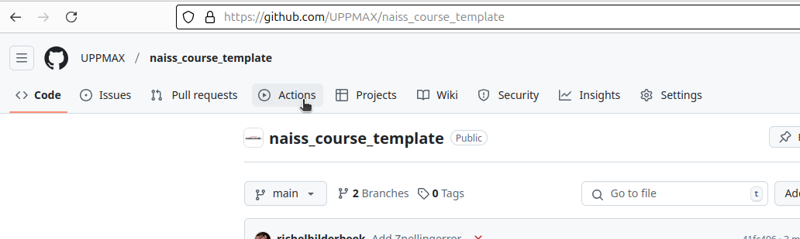
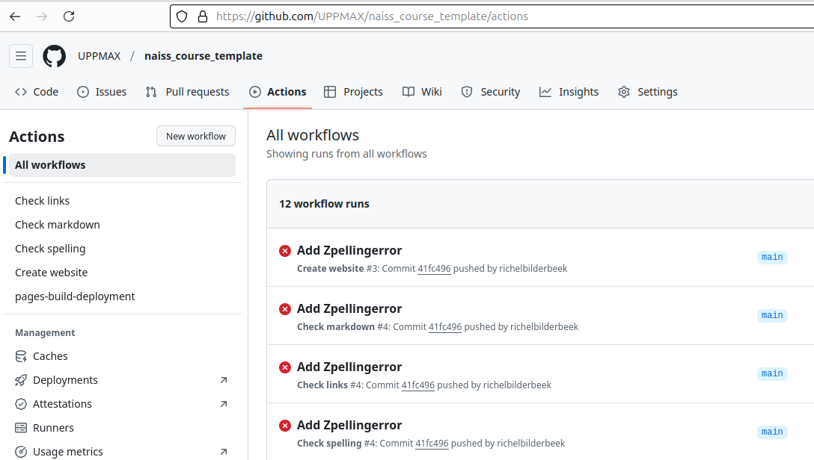
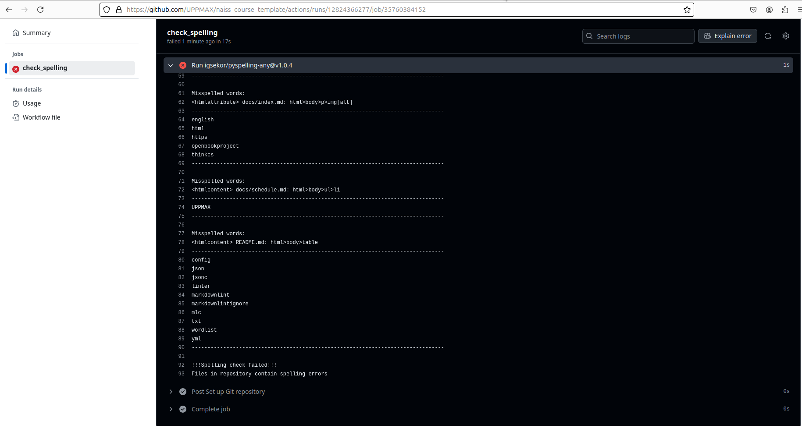
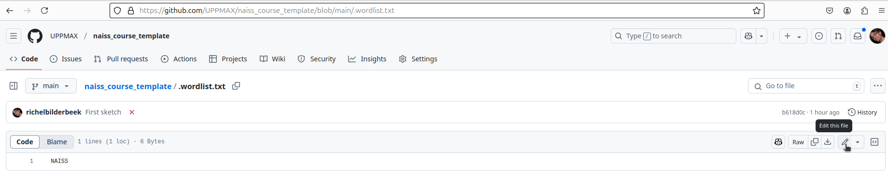
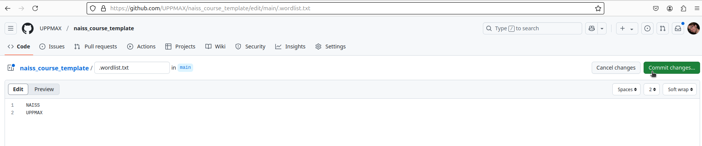
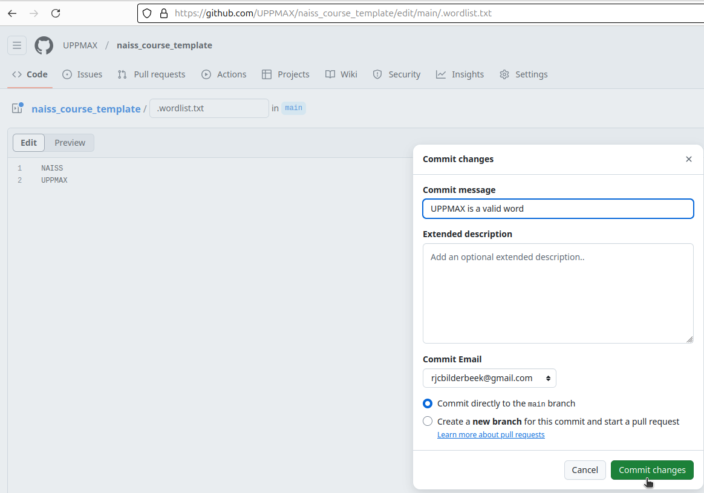

# How to fix spelling errors

This repository checks multiple things automatically after each change.
This page shows how to fix spelling errors.

There are two types of errors:

- Actual spelling errors
- Words that are flagged as spelling errors, but are not

To see both of these, do the following steps:

- At the repository's main page, click the tab 'Actions'

???- question "Where is that?"

    It is the 4th horizontal tab.

    

- You will see the results of the tests run by GitHub Actions

???- question "How does that look like?"

    The results of the tests run by GitHub Actions:

    

- Click on the Action that has the name `check_spelling` (this
  name is below the commit message)

???- question "Where do I click?"

    Click on the Action that has the name `check_spelling`.

    

- In the Action workflow overview, click `check_spelling`

???- question "Where do I click?"

    Click `check_spelling`.

    

- You will be taken to the log of the `check_actions` script.
  Here you can read the errors.

???- question "How does that look like?"

    The bottom of the log of the `check_actions` script

    

Actual spelling errors will be shown in the log.

???- question "How does that look like?"

    A spelling errors that is a spelling error.
    It shows the spelling error and the file that contains the spelling
    error.

    

To fix these, modify the files with the spelling errors.

Words that are flagged as spelling errors, but are not,
will also be shown in the log

???- question "How does that look like?"

    Here are multiple spelling errors that are not spelling errors,
    especially `UPPMAX` (the Uppsala HPC center) is a clear example
    of an incorrectly labeled spelling error.

    

To whitelist/allowlist such an error, modify the plain-text file `.wordlist`
(in the project's root folder)
and add the words you want to allow.

???- question "How to edit `.wordlist`?"

    In the repository's main page, click `.wordlist`

    

    Click 'Edit'.

    

    Add the words you want to allow (use one per line)
    and click 'Commit'

    

    Click 'Commit changes'.

    

    Now, the `.wordlist` file has been changed.

    

    This immediately triggers a new spellcheck :-)
