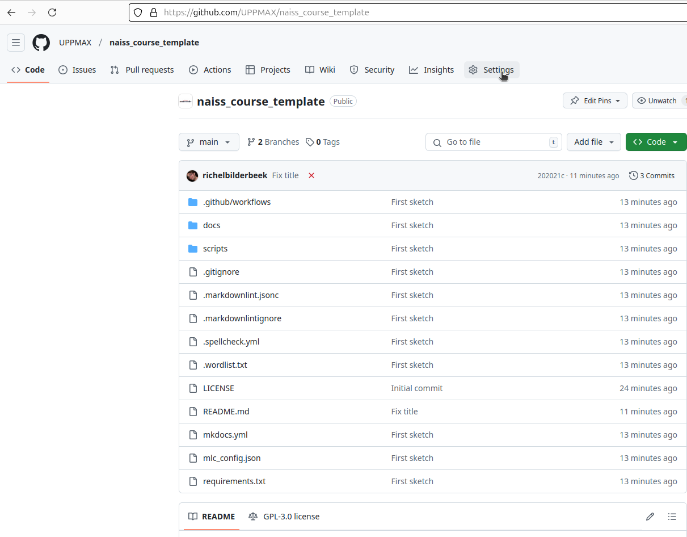
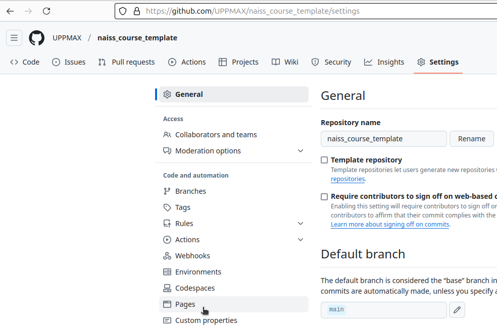
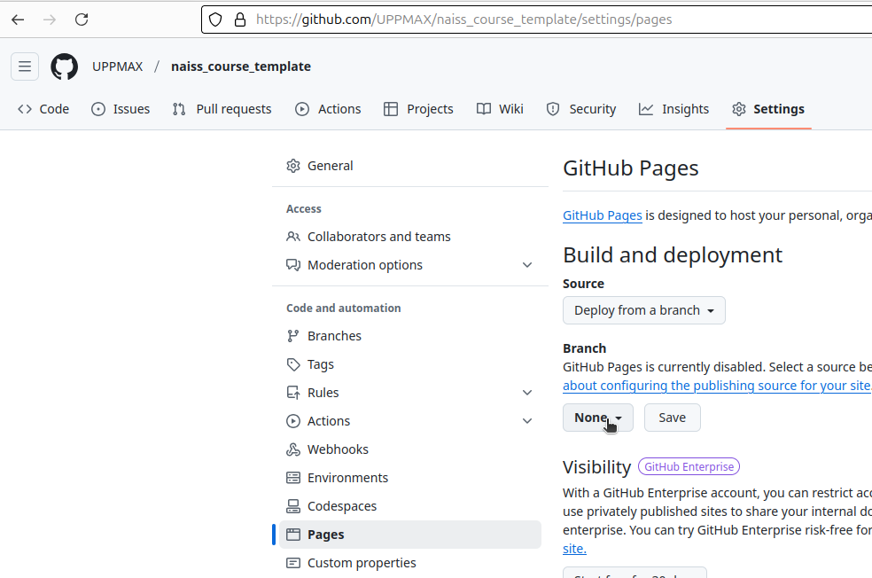
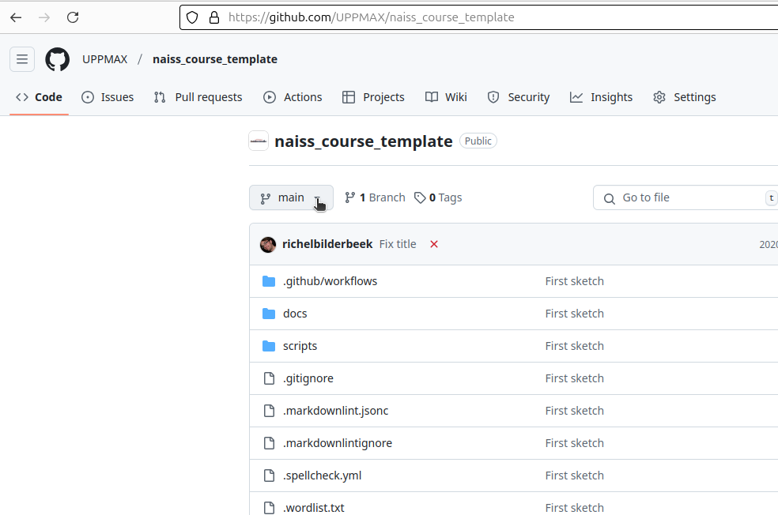
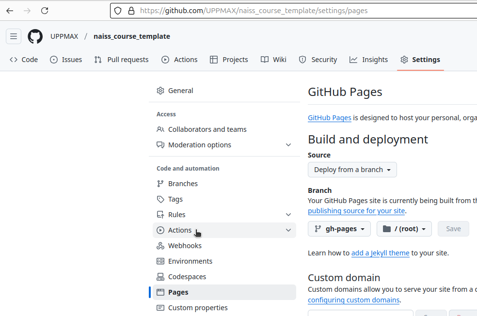
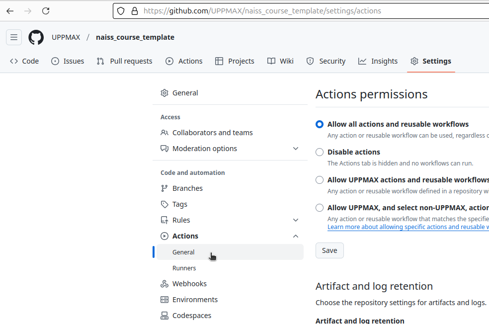
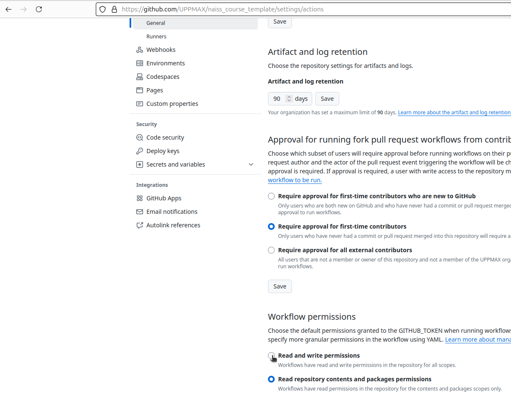
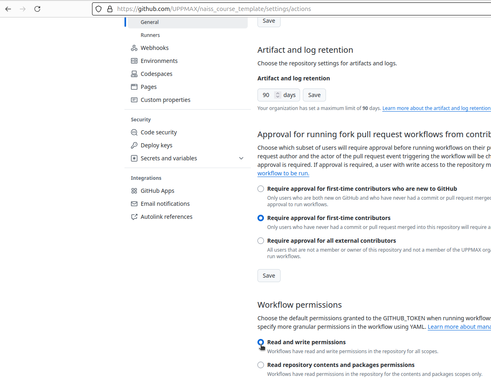

# How to setup the rendering of the website

This repository automatically deploys
a nicely rendered website upon each change.

## Step 1: Setup deploy branch `gh-pages`

To set this up, we need to click 10x and type 8 characters.

- At the GitHub repository page, click 'Settings'

???- question "Where is that?"

    'Settings' is found at the top-left of the screen

    

???- question "I do not see 'Settings'"

    This means you do not have the access rights to do so.

- In the 'Settings' menu, click 'Pages'

???- question "Where is that?"

    'Pages' is found at the left menu list

    

- In the 'Pages' menu, click 'Branch'

???- question "Where is that?"

    'Branch' is found at the top of the page.

    

- Try to change the branch to `gh-pages` and fail:
  it will probably say 'No results found'

???- question "How does that look like?"

    Here the branch `gh-pages` cannot be found:

    

- At the main page of the repository, click on the combobox
  of which branch is actively displayed.
  It will likely display the word `main`

???- question "How does that look like?"

    Here is the combobox of the actively displayed branch:

    

- Click on the empty edit line above the branch(es)
  to edit it

???- question "How does that look like?"

    The empty edit line above the branch `main`:

    

- Type the word `gh-pages`

???- question "How does that look like?"

    The word `gh-pages` has been typed.

    

- Click on 'Create branch `gh-pages` from `main`

???- question "How does that look like?"

    Click on 'Create branch `gh-pages` from `main`.

    

- Go to 'Settings | Pages' and observe that `gh-pages`
  is now there

???- question "How does that look like?"

    The 'Pages' page shows that `gh-pages` is used.

    

## Step 2: allow a bot to deploy

- In the 'Settings' tab, click 'Actions'

???- question "How does that look like?"

    Click on 'Actions'

    

- In the 'Settings | Actions' menu dropdown item, click 'General'
  to go the general Actions setting.

???- question "Where do I click?"

    Click on 'General'

    

???- question "How does that look like?"

    The general Actions settings look like this.

    

- Scroll down to 'Workflow permissions'.
  Click on 'Read and write'.

???- question "Where do I click?"

    Click on 'Read and write'.

    

???- question "How does that look like?"

    Clicked on 'Read and write'.

    
actions_setting_workflow_permissions_clicked_read_and_write.png

Done!

Next time when there is a change in the repository,
the nicely rendered website is deployed automatically.
