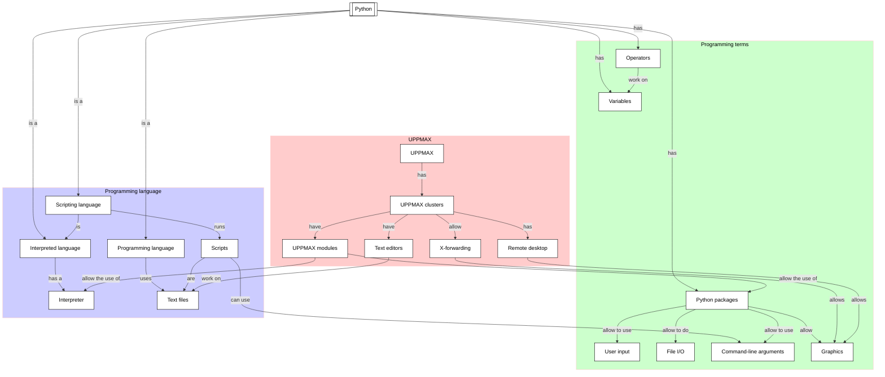

# Command-line arguments

!!!- info "Learning objectives"

    - Can read the command-line arguments
    - Can run a Python script with command-line arguments

???- question "For teachers"

    Teaching goals are:

    - Learners have used sys.args
    - Learners have run a Python script with command-line arguments

    Lesson plan:

    - 5 mins: prior knowledge
    - 5 mins: presentation
    - 15 mins: challenge
    - 5 mins: feedback

    Prior:

    - What are command-line arguments?
    - What is meant with 'a command-line interface'?
    - Why use command-line arguments?

## Overview

Sometime, also programs need input, for example
the name of the input file and the name of a results file:

```bash
python my_input.csv my_results.csv
```

Sometime you need to get 'stuff to work', for example,
code written by someone else.
In this session, we practice this,
going through the problems and errors that occur
when you want to 'just want to run the stupid code'.




## Exercises

See the exercise procedure [here](../misc/exercise_procedure.md).

### Exercise 1: Read the command-line arguments

!!!- info "Learning objectives"

    - Rehearse creating a script
    - Read the command-line arguments

Read the official Python documentation about `sys.argv` [here](https://docs.python.org/3/library/sys.html#sys.argv).

Create a script with the following text:

``` python title="read_argv.py"
import sys

print(sys.argv)
```

Run the Python script as shown below. What does it print?

- `python read_argv.py`

???- question "Answer"

    ```bash
    ['read_argv.py']
    ```

Run the Python script as shown below. What does it print?

- `python read_argv.py hello world`

    ```bash
    ['read_argv.py', 'hello', 'world']
    ```

Run the Python script as shown below. What does it print?

- `python read_argv.py "hello world"`

    ```bash
    ['read_argv.py', 'hello world']
    ```

Run the Python script as shown below. What does it print?

- `python read_argv.py 'hello world'`

    ```bash
    ['read_argv.py', 'hello world']
    ```

### Exercise 2: Read a command-line argument

!!!- info "Learning objectives"

    - Experience `sys.argv` is a list
    - First experience in working with a list

`sys.argv` is a list. Here we use this list

Read the following sections of
[How to Think Like a Computer Scientist: Learning with Python 3](https://openbookproject.net/thinkcs/python/english3e/index.html):

- `11. Lists`
- `11.1. List values`
- `11.2. Accessing elements`

Modify the script in such a way that the script will only show the first command-line
argument.

For example, running the script like this:

```bash
python read_argv.py hello world
```

it should show `hello`.

### Exercise 3: Work with a command-line argument

!!!- info "Learning objectives"

    - Do a first string comparison

Read the following sections of
[How to Think Like a Computer Scientist: Learning with Python 3](https://openbookproject.net/thinkcs/python/english3e/index.html):

- 8.7. String comparison

Now, we make the script produce different output.

If the script is run like this:

```bash
python read_argv.py hello
```

it should show `Hello human!`.

If the script is run like this:

```bash
python read_argv.py bye
```

it should show `Sad to see you go human!`.

Write the script to do that.

## Links

- [How to Think Like a Computer Scientist: Learning with Python 3](https://openbookproject.net/thinkcs/python/english3e/index.html)
