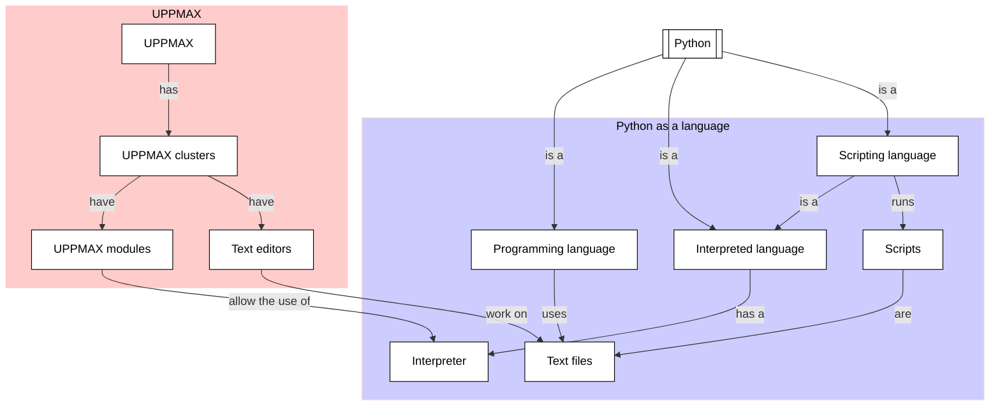

# The Way Of The Program

!!!- info "Learning objectives"

    - Practice using the UPPMAX documentation
    - Practice using the Python book
      [How to Think Like a Computer Scientist: Learning with Python 3](https://openbookproject.net/thinkcs/python/english3e/index.html)
    - Get a first impression of what the Python programming language is
    - Know the basics of what the Python interpreter is
    - Get a first idea of what a program is
    - Hear about the three types of errors
    - Build up experience with the Python interpreter
    - Use a text editor on an UPPMAX HPC cluster
    - Create a Python script
    - Run a Python script

???- question "For teachers"

    Teaching goals are:

    - Learners have a general idea about what the Python programming language is
    - Learners have used the word 'Python interpreter'
    - Learners have a general idea about what a program is
    - Learners have used the terms syntax error, runtime error and semantic error
    - Learners have run code in the Python interpreter

    Other goals are:

    - Verify that learners indeed have learned how to create a file
    - Verify that learners indeed have learned how to use a text editor

    Lesson plan:

    - 5 mins: prior knowledge
    - 5 mins: presentation
    - 15 mins: challenge
    - 5 mins: feedback

    Prior questions:

    - What types of programming errors exist?
    - Can you name of types of programming bugs?
    - What is a script?
    - Can you name a text editor?

## Why?

At the start of learning Python, there are many new terms.
Using a book to learn these is a good start.

What is Python? What is a programming language?
What type of errors will I write when programming?
How do I write code in Python?

These fundamental question are discussed and practiced in this session.




## Exercises

???- question "Enjoy a video?"

    You can find a video with solutions to these exercises
    [here](https://youtu.be/r-4-vAO-uac)

See the exercise procedure [here](../misc/exercise_procedure.md).

### Exercise 1: Python and the Python interpreter

!!!- info "Learning objectives"

    - Get a first impression of what the Python programming language is
    - Know the basics of what the Python interpreter is
    - Get a first idea of what a program is
    - Hear about the three types of errors
    - Build up experience with the Python interpreter

Read the following sections of
[How to Think Like a Computer Scientist: Learning with Python 3](https://openbookproject.net/thinkcs/python/english3e/index.html):

- 1.1 The Python programming language
- 1.2. What is a program?
- 1.4. Syntax errors
- 1.5. Runtime errors
- 1.6. Semantic errors
- 1.9. The first program

Then in section 1.12, do exercises 1 to and including 5. For your convenience,
the questions are copy-pasted below:

!!! question "1.12.1"

    Write an English sentence with understandable semantics
    but incorrect syntax.
    Write another English sentence which has correct syntax
    but has semantic errors.

???- question "Answer"

    From the Wikipedia link: 'A syntax error is an error in the syntax of a
    sequence of characters that is intended to be written
    in a particular programming language'.

    An English sentence with understandable logic but incorrect syntax:

    ```text
    One plus one is twoooooooo
    ```

    A semantic error is also called a logic error,
    hence a sentence with correct syntax and semantic errors is:

    From [here](https://english.stackexchange.com/a/29521), where the sentence
    is attributed to Noam Chomsky:

    ```text
    Colorless green ideas sleep furiously
    ```

    From [here](https://english.stackexchange.com/a/29509):

    ```text
    My mother's white cat is black.
    ```


!!! question "1.12.2"

    Using the Python interpreter, type `1 + 2` and then hit return.
    Python evaluates this expression, displays the result,
    and then shows another prompt.
    `*` is the multiplication operator,
    and `**` is the exponentiation operator.
    Experiment by entering different expressions
    and recording what is displayed by the Python interpreter.

???- question "Answer"

    This is more about experimenting with the operators `+`, `*` and `**`.
    Here are some things to let the Python interpreter evaluate:

    ```python
    1+2
    1 + 2
    1*2
    2 * 3
    2**3
    ```

!!! question "1.12.3"

    Type `1 2` and then hit return. Python tries to evaluate the expression,
    but it can't because the expression is not syntactically legal.
    Instead, it shows the error message:

    ```text
    File "<interactive input>", line 1
    1 2
      ^
    SyntaxError: invalid syntax
    ```

    In many cases, Python indicates where the syntax error occurred,
    but it is not always right,
    and it doesn't give you much information about what is wrong.

    So, for the most part, the burden is on you to learn the syntax rules.

    In this case, Python is complaining
    because there is no operator between the numbers.

    See if you can find a few more examples of things that will produce error
    messages when you enter them at the Python prompt.
    Write down what you enter at the prompt
    and the last line of the error message that Python reports back to you.

???- question "Answer"

    This question is more about experimenting, armed with limited knowledge
    on `+`, `*`, `**` and `print`.

    Here are some of my favorites:

    ```text
    >>>  1
      File "<stdin>", line 1
        1
    IndentationError: unexpected indent

    >>> print 1
      File "<stdin>", line 1
        print 1
        ^^^^^^^
    SyntaxError: Missing parentheses in call to 'print'. Did you mean print(...)?

    >>> print 1 + 1
      File "<stdin>", line 1
        print 1 + 1
        ^^^^^^^^^^^
    SyntaxError: Missing parentheses in call to 'print'. Did you mean print(...)?

    >>> print(1) + print(1)
    1
    1
    Traceback (most recent call last):
      File "<stdin>", line 1, in <module>
    TypeError: unsupported operand type(s) for +: 'NoneType' and 'NoneType'

    >>> 1++
      File "<stdin>", line 1
        1++
           ^
    SyntaxError: invalid syntax
    ```

!!! question "1.12.4"

    Type `print("hello")`.
    Python executes this, which has the effect of printing the letters
    h-e-l-l-o. Notice that the quotation marks that you used to enclose the
    string are not part of the output.
    Now type "hello" and describe your result.
    Make notes of when you see the quotation marks and when you don’t.

???- question "Answer"

    Here are the four combinations of using `print` yes/no and
    using single/double quotes:

    ```text
    >>> print("Hello")
    Hello
    >>> print('Hello')
    Hello
    >>> "Hello"
    'Hello'
    >>> 'Hello'
    'Hello'
    ```

    A correct conclusion is:

    - When using `print`, any type of quotes is removed
    - When not using `print`, the word is printed in single quotes

!!! question "1.12.5"

    Type `cheese` without the quotation marks.
    The output will look something like this:

    ```text
    Traceback (most recent call last):
      File "<interactive input>", line 1, in ?
    NameError: name 'cheese' is not defined
    ```

    This is a run-time error; specifically, it is a `NameError`,
    and even more specifically, it is an error because the name `cheese`
    is not defined. If you don't know what that means yet, you will soon.

???- question "Answer"

    This is more of an explanation. Indeed:

    ```text
    >>> cheese
    Traceback (most recent call last):
      File "<stdin>", line 1, in <module>
    NameError: name 'cheese' is not defined
    ```

### Exercise 2: Running a Python script

!!!- info "Learning objectives"

    - create a Python script
    - run a Python script
    - use a text editor on an UPPMAX HPC cluster


!!! question "1.12.6.1"

    Type `6 + 4 * 9` at the Python prompt and hit enter. Record what happens.

???- question "Answer"

    ```text
    >>> 6 + 4 * 9
    42
    ```

!!! question "1.12.6.2"

    Now create a Python script with the following contents:

    ```python
    6 + 4 * 9
    ```

    What happens when you run this script?

Tip: search [the UPPMAX documentation](https://docs.uppmax.uu.se)
for a text editor. Use the simplest one.

???- question "Answer"

    Text editors are documented at
    <https://docs.uppmax.uu.se/software/text_editors/>.

    The simplest text editor is called `nano` and is documented at
    <https://docs.uppmax.uu.se/software/nano/>.

    Creating a Python script `my_script.py` using `nano`:

    ```bash
    nano my_script.py
    ```

    The content of the file should be:

    ```python
    6 + 4 * 9
    ```

    Running the Python script `my_script.py`:

    ```bash
    python my_script.py
    ```

!!! question "1.12.6.3"

    Now change the script contents to:

    ```python
    print(6 + 4 * 9)
    ```

    and run it again.

    What happened this time?

???- question "Answer"

    Modifying the Python script again:

    ```bash
    nano my_script.py
    ```

    The content of the file should be:

    ```python
    print(6 + 4 * 9)
    ```

    Running the Python script `my_script.py`:


    ```text
    python3 my_script.py
    ```

    Gives:

    ```text
    42
    ```

!!! question "1.12.6.4"

    Whenever an expression is typed at the Python prompt,
    it is evaluated and the result is automatically shown on the line below
    (Like on your calculator,
    if you type this expression you'll get the result 42).

    A script is different, however.
    Evaluations of expressions are not automatically displayed,
    so it is necessary to use the `print` function to make the answer show up.

    It is hardly ever necessary to use the `print` function
    in immediate mode at the command prompt.

???- question "Answer"

    There is no question there :-)
